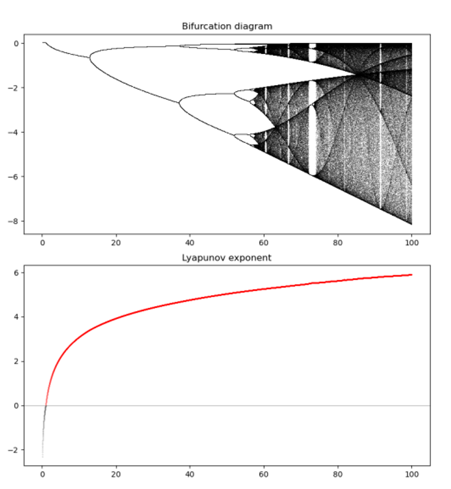
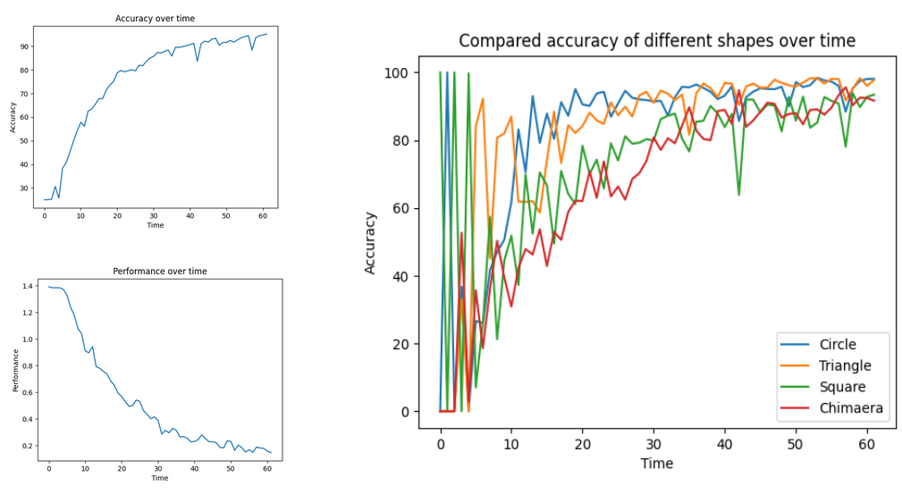

## Portfolio

---

### Mathematical modelization 

[Game of trust with synthetic community of cells](https://github.com/yaiza612/syncells_game_trust)

With this simulation is possible to see study the behavior altruistic or egoistic of different cells playing the [game of trust](https://ncase.me/trust/). The code of the simulation is based in the game of life.

---
[Nonlinear dynamical equations](https://github.com/yaiza612/Modelization)
With the code I implemented in this repository is possible to study the dynamics of the different function maps (*logistic, tent, cubic, sine, exponential and quotient*), nonlinear dynamical equations that can be use as examples of chaotic behaviour. As well, it is implemented the code needed for represent the bifurcation diagram, lyapunov exponent and the cobweb plots.

---
[Brain simulation with game of life](https://github.com/yaiza612/Life-Yaiza-s-Brain)
This is another version of the game of life, where I represent excitatory and inhibitory neuros instead of just cells. The rules are of course personalize with this purpose: 0 represents inactivated neurons, 1 represents activated neurons; in other array, 0 represents inhibitory neurons, and 1 represents excitatory neurons. Moreover to take in account the calcium levels, when there are way too many activated neurons, there is a restart to recover the level of calcium of our "brain". With my version of the game of life, it is possible to study the different patterns shaped when changing the initial conditions: amount of excitatory and inhibitory neurons.

---

### Machine learning

- **Drug Lead Discovery with Machine Learning**
In this project I created an automated pipeline to lead discovery based in ligan based screening. Concretely, my goal is demonstrate that it is posible retrieve good candidate for **inhibit KIT** (<mark>overexpressed in acute leukemia</mark>) using artificial inteligence. A lot of different scientist have tried to find a good candidate to inhibit KIT, sadly without success. Nevertheless, this approach (machine learning) was not use yet to retrieve inhibitors against KIT. I tried different methods: **small neural network with keras, logistic regression, random forest, SVM, multilayer perceptron, and the code from Attention-based Multi-Input Deep Learning Architecture for Biological Activity Prediction: An Application in EGFR Inhibitors. Huy Ngoc Pham et al., 2019 to also implement a neural network with attention.** To finish with the project I chose the prediction of the best model and made **molecular docking** and an **ADMET screening** to  select the best candidates. 
([Github](https://github.com/yaiza612/Ligand_based_screening))

- **Exploring CNN neural networks**

Humans are good at recognizing symbols but what about chimeras? By showing the datasets of 6 elements grouped pairwise, Legenyel showed humans are worse at finding chimeras than normal symbols. To improve human accuracy Lengenyel added haptic stimuli: breaking appart the images. This improved the recognition of the chimeras in humans. The question I made myself after knew about the Legenyel's experiments is, **how does this work on CNNs networks?** This [repository](https://github.com/yaiza612/Link-between-brain-and-machine) contains the code of **three neural networks**: naive network (only trained with squares, triangles and circles), random network (trained with figures and random pixels) and chimaera network (trained with figures and chimaeras, e.g. triangle mixed with square). The best accuracy was achieved by the chimaera network, something expected, but also tell us something interestings, CNNs as humans have problems to recognize chimaeras they didn't see before. 

  #### Big data 
  My solutions to the assignments of the lectures in Big Data by Universidad Politécnica de Madrid (UPM), Master of Computational Biology.
  
  
  
- **Dog Food Day:**
Inaccuracies in car insurance company’s claim predictions raise the cost of insurance for good drivers and reduce the price for bad ones. In this competition, you’re challenged to build a model that predicts the probability that a driver will initiate an auto insurance claim. While Kaymo ™ has used machine learning for the past 10 years, they’re looking to the CAIIS machine learning community to explore new, more powerful methods. A more accurate prediction will allow them to further tailor their prices, and hopefully make auto insurance coverage more accessible to more drivers. The solution should be in Spark. 
([Github](https://github.com/yaiza612/Big_data/tree/main/Trees/CAIIS.ipynb))
- **Hack data:** 
A technology start-up in California has recently been hacked, and their forensic engineers have grabbed valuable information, including information like session time, locations, wpm typing speed, etc, to identify how many hackers did it. The goal is to use SparkML to do this. 
([Github](https://github.com/yaiza612/Big_data/tree/main/Clustering))
- **Predicting Crew Members:**
Hyunday Heavy Industries need help to build a predictive model for some ships. They want to stimate how many crew members a ship will require. The goal is to use SparkML to do this.
([Github](https://github.com/yaiza612/Big_data/tree/main/LinearRegression))
- **Predicting Dog Food Spoiling:**
Purina Dog Food Company is trying to understand why some batches of their dog food are spoiling much quicker than intended. The goal is to use SparkML to do this. 
([Github](https://github.com/yaiza612/Big_data/tree/main/Trees/Consulting_proyect_predicting_dog_food_spoiling.ipynb))
- **Xray Image Classification:**
Final project consisting in the classification of pneumonia from X-Ray images using Scalable Deep Learning with Spark. 
([Github](https://github.com/yaiza612/scalable_classification_x_ray_data))

---
### Bioinformatic analysis 

My repositories with helpful scripts and programs to analyze omic data.

- [Transcriptomics and Single Cell Genomics](https://github.com/yaiza612/Transcriptomics_and_single_cell)
- [Genomic analysis](https://github.com/yaiza612/Genomics_analysis_pipeline)
- [Bioinformatic Challenges](https://github.com/yaiza612/challenges)

---
### Statistics

- **Climate Change:** 
An analysis of different datasets to get better insights about the climate change. ([Github](https://github.com/yaiza612/Climate_change))

---

Page template forked from <a href="https://github.com/evanca/quick-portfolio">evanca</a>

<!-- Remove above link if you don't want to attibute -->
